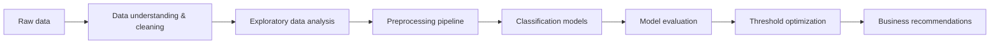
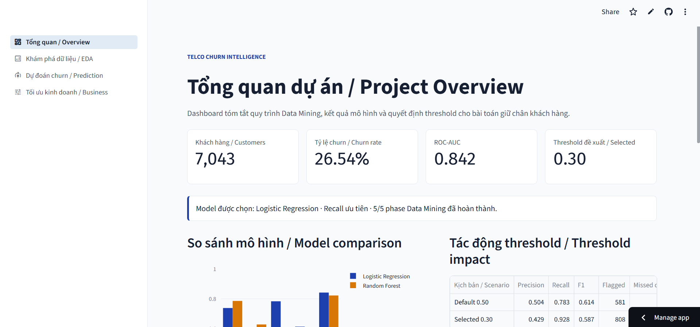
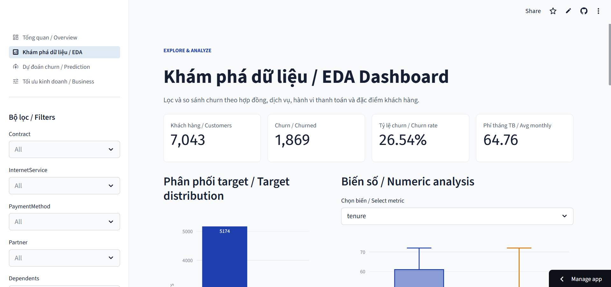
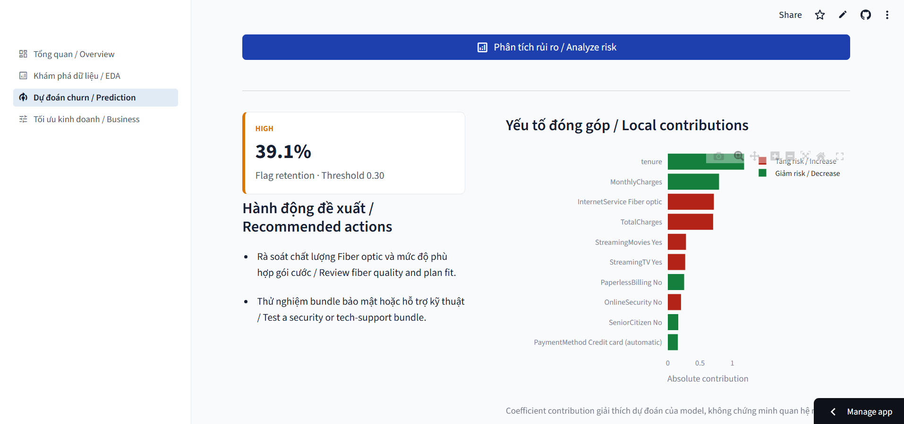
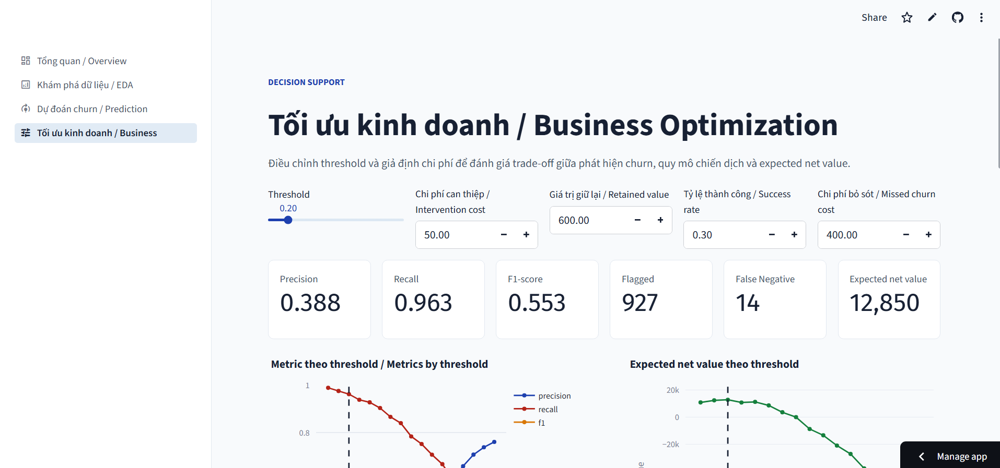

# Telco Customer Churn - Data Mining Project

Dự án môn **Data Mining** tập trung phân tích và dự đoán khả năng khách hàng rời bỏ dịch vụ viễn thông trên bộ dữ liệu Telco Customer Churn. Quy trình bao gồm làm sạch dữ liệu, EDA, kiểm định thống kê, xây dựng mô hình phân loại, tối ưu threshold và chuyển kết quả dự đoán thành đề xuất giữ chân khách hàng.

## Tổng quan

Customer churn xảy ra khi khách hàng ngừng sử dụng dịch vụ của doanh nghiệp. Việc nhận diện sớm nhóm khách hàng có nguy cơ rời bỏ giúp doanh nghiệp:

- Ưu tiên nguồn lực cho các chiến dịch retention.
- Thiết kế ưu đãi phù hợp với từng nhóm rủi ro.
- Giảm chi phí mất khách và tìm kiếm khách hàng mới.
- Cải thiện trải nghiệm dịch vụ và giá trị vòng đời khách hàng.

Đối tượng có thể sử dụng kết quả gồm marketing team, customer retention team, business managers và nhà quản trị trong lĩnh vực viễn thông.

## Mục tiêu

1. Khám phá đặc điểm của khách hàng churn và không churn.
2. Xác định các yếu tố có liên hệ đáng kể với churn.
3. Xây dựng pipeline phân loại có khả năng tái lập và hạn chế data leakage.
4. So sánh Logistic Regression và Random Forest.
5. Ưu tiên Recall và F1-score của lớp `Churn = Yes`.
6. Tối ưu threshold theo ràng buộc kỹ thuật và giả định kinh doanh.
7. Tạo danh sách khách hàng ưu tiên và đề xuất hành động giữ chân.

## Dataset

Dự án sử dụng bộ dữ liệu **Telco Customer Churn**:

| Thuộc tính | Giá trị |
|---|---:|
| Số khách hàng | 7,043 |
| Số cột | 21 |
| Biến mục tiêu | `Churn` |
| Churn = Yes | 1,869 |
| Churn = No | 5,174 |
| Tỷ lệ churn | 26.54% |

Dữ liệu bao gồm:

- Thông tin cá nhân: giới tính, người cao tuổi, partner, dependents.
- Thời gian sử dụng: `tenure`.
- Dịch vụ: Internet, điện thoại, bảo mật, backup, tech support, streaming.
- Hợp đồng và thanh toán: contract, billing, payment method.
- Chi phí: `MonthlyCharges`, `TotalCharges`.
- Trạng thái rời bỏ: `Churn`.

File dữ liệu gốc:

```text
data/raw/telco_customer.csv
```

## Quy trình thực hiện



### Phase 1 - Khởi tạo dự án

- Xây dựng cấu trúc thư mục.
- Thiết lập Python 3.12 và dependencies.
- Tách tham số dự án vào YAML config.
- Chuẩn hóa đường dẫn bằng `pathlib`.

### Phase 2 - Data Understanding

- Kiểm tra shape, schema, missing values, duplicate và unique values.
- Chuyển `SeniorCitizen` sang dạng categorical.
- Chuyển `TotalCharges` sang numeric.
- Điền `TotalCharges = 0` cho khách hàng có tenure bằng 0.
- Xuất dữ liệu processed:

```text
data/processed/features.csv
data/processed/target.csv
```

### Phase 3 - Exploratory Data Analysis

- Phân tích phân phối target.
- So sánh `tenure`, `MonthlyCharges`, `TotalCharges` theo churn.
- Tính churn rate theo hợp đồng, dịch vụ và phương thức thanh toán.
- Phân tích correlation cho biến số.
- Thực hiện Chi-square test cho biến phân loại.
- Khám phá interaction giữa contract, tenure, Internet service và payment method.

### Phase 4 - Classification

Pipeline preprocessing:

- Numeric: median imputation và `StandardScaler`.
- Categorical: most-frequent imputation và `OneHotEncoder`.

Mô hình:

- Logistic Regression.
- Random Forest.

Metric:

- Accuracy.
- Precision, Recall và F1-score cho lớp churn.
- ROC-AUC.
- Confusion matrix và classification report.

### Phase 5 - Threshold & Business Optimization

- Phân tích ROC và Precision-Recall curve.
- Kiểm tra calibration và Brier score.
- Thử threshold từ `0.10` đến `0.90`.
- Mô phỏng chi phí can thiệp, lợi ích giữ chân và chi phí bỏ sót churn.
- Chọn threshold theo Precision, Recall và expected net value.
- Tạo danh sách khách hàng ưu tiên retention.

## Kết quả EDA

Các phát hiện chính:

- Khách churn có tenure trung bình **17.98 tháng**, thấp hơn nhóm không churn **37.57 tháng**.
- MonthlyCharges trung bình của nhóm churn là **74.44**, cao hơn nhóm không churn **61.27**.
- Hợp đồng `Month-to-month` có churn rate **42.71%**.
- Hợp đồng `Two year` có churn rate chỉ **2.83%**.
- Khách dùng `Fiber optic` có churn rate **41.89%**.
- Khách không có `OnlineSecurity` hoặc `TechSupport` có churn rate trên **41%**.
- `Electronic check` có churn rate cao nhất trong các phương thức thanh toán: **45.29%**.

Chi-square test cho thấy `Contract`, `InternetService`, `OnlineSecurity`, `TechSupport`, `PaymentMethod`, `PaperlessBilling`, `Dependents` và `Partner` đều có liên hệ thống kê với churn.

Chân dung rủi ro cao thường là khách hàng có tenure thấp, hợp đồng tháng, MonthlyCharges cao, dùng Fiber optic, thiếu dịch vụ hỗ trợ và thanh toán bằng Electronic check.

> Các kết quả EDA thể hiện mối liên hệ trong dữ liệu, không chứng minh quan hệ nhân quả.

## Kết quả mô hình

Kết quả tại threshold mặc định `0.50`:

| Model | Accuracy | Precision | Recall | F1-score | ROC-AUC |
|---|---:|---:|---:|---:|---:|
| Logistic Regression | 0.738 | 0.504 | 0.783 | 0.614 | 0.842 |
| Random Forest | 0.786 | 0.629 | 0.471 | 0.538 | 0.822 |

**Logistic Regression** được chọn làm model tốt nhất vì đạt Recall và F1-score cao hơn cho lớp churn. Random Forest có Accuracy và Precision tốt hơn nhưng bỏ sót nhiều khách churn hơn.

Model được lưu tại:

```text
models/best_model.joblib
```

## Threshold đề xuất

Threshold được chọn là **0.30** với điều kiện:

- Precision tối thiểu: `0.40`.
- Recall tối thiểu: `0.70`.
- Tối ưu expected net value trong nhóm threshold hợp lệ.

| Metric | Threshold 0.30 |
|---|---:|
| Precision | 0.429 |
| Recall | 0.928 |
| F1-score | 0.587 |
| Khách hàng bị flag | 808 |
| True Positive | 347 |
| False Positive | 461 |
| False Negative | 27 |

So với threshold `0.50`, threshold mới giảm số khách churn bị bỏ sót từ **81 xuống 27**, nhưng làm tăng quy mô chiến dịch và số False Positive.

Các giả định business hiện tại:

| Giả định | Giá trị |
|---|---:|
| Chi phí can thiệp mỗi khách hàng | 50 |
| Giá trị khách hàng giữ lại | 600 |
| Tỷ lệ giữ chân thành công | 30% |
| Chi phí bỏ sót một khách churn | 400 |

Các giá trị này chỉ phục vụ mô phỏng và cần được thay bằng dữ liệu tài chính thực tế trước khi triển khai.

## Đề xuất kinh doanh

- Ưu tiên khách hàng có risk tier `Critical` và `High`.
- Tăng cường onboarding trong 3-6 tháng đầu.
- Khuyến khích khách hàng chuyển từ hợp đồng tháng sang hợp đồng dài hạn.
- Rà soát trải nghiệm Fiber optic và các gói có MonthlyCharges cao.
- Thử nghiệm bundle OnlineSecurity hoặc TechSupport.
- Khuyến khích chuyển từ Electronic check sang auto-payment.
- Đo hiệu quả bằng A/B test hoặc randomized holdout.

## Cấu trúc dự án

```text
Customer-Churn-DM/
├── configs/
│   ├── base.yaml
│   ├── classification.yaml
│   └── clustering.yaml
├── data/
│   ├── raw/
│   │   └── telco_customer.csv
│   └── processed/
│       ├── features.csv
│       └── target.csv
├── models/
│   ├── best_model.joblib
│   ├── best_model_metadata.json
│   └── selected_threshold.json
├── notebooks/
│   ├── 01_data_understanding.ipynb
│   ├── 02_eda.ipynb
│   ├── 03_classification.ipynb
│   └── 04_model_calibration_threshold_and_business_optimization.ipynb
├── reports/
├── .gitignore
├── README.md
└── requirements.txt
```

## Cài đặt

Yêu cầu:

- Python 3.12.
- Jupyter Notebook hoặc VS Code có Jupyter extension.

Trên Windows PowerShell:

```powershell
py -3.12 -m venv .venv
.\.venv\Scripts\Activate.ps1
python -m pip install --upgrade pip
pip install -r requirements.txt
python -m ipykernel install --user --name customer-churn-dm --display-name "Python (.venv)"
```

Chọn kernel `Python (.venv)` trước khi chạy notebook.

Kiểm tra môi trường:

```powershell
python -c "import pandas, numpy, sklearn, scipy, yaml, joblib; print('Environment ready')"
```

## Cách chạy

Chạy notebook theo đúng thứ tự:

1. `notebooks/01_data_understanding.ipynb`
2. `notebooks/02_eda.ipynb`
3. `notebooks/03_classification.ipynb`
4. `notebooks/04_model_calibration_threshold_and_business_optimization.ipynb`

Mỗi notebook phụ thuộc vào output của notebook trước. Nên sử dụng **Restart Kernel and Run All** để kiểm tra khả năng tái lập.

## Streamlit Dashboard

Ứng dụng MVP gồm bốn trang:

1. Tổng quan dự án và kết quả mô hình.
2. EDA dashboard có bộ lọc và biểu đồ tương tác.
3. Dự đoán một khách hàng hoặc scoring CSV hàng loạt.
4. Tối ưu threshold, business assumptions và danh sách retention.

Chạy ứng dụng local:

```powershell
streamlit run app/app.py
```

Mặc định ứng dụng chạy tại:

```text
http://localhost:8501
```

### Deploy Streamlit Community Cloud

1. Push repository và các artifact được theo dõi lên GitHub.
2. Truy cập Streamlit Community Cloud và chọn **Create app**.
3. Chọn repository `customer-churn-data-mining`.
4. Chọn branch cần deploy.
5. Đặt entrypoint:

```text
app/app.py
```

6. Deploy. Ứng dụng không yêu cầu secrets hoặc authentication.

Các artifact bắt buộc cho bản deploy:

```text
models/best_model.joblib
models/best_model_metadata.json
models/selected_threshold.json
reports/classification_model_comparison.csv
reports/business_threshold_analysis.csv
data/raw/telco_customer.csv
```

## Demo ứng dụng

Trải nghiệm phiên bản đã triển khai trên Streamlit Community Cloud:

**[Mở Telco Churn Intelligence Dashboard](https://customer-churn-data-mining-vha.streamlit.app/business)**

> Thay `https://customer-churn-data-mining-vha.streamlit.app/business` bằng URL Streamlit Cloud thực tế của dự án.

### 1. Tổng quan / Overview



Trang tổng quan trình bày KPI chính, kết quả so sánh mô hình, tác động của
threshold và tiến độ các phase trong quy trình Data Mining.

### 2. Khám phá dữ liệu / EDA Dashboard



EDA Dashboard hỗ trợ lọc dữ liệu, phân tích phân phối churn, đặc trưng số,
đặc trưng phân loại, tương quan và kết quả kiểm định Chi-square.

### 3. Dự đoán churn / Churn Prediction



Trang dự đoán hỗ trợ chấm điểm một khách hàng hoặc tệp CSV, phân nhóm mức
rủi ro và giải thích các đặc trưng làm tăng hoặc giảm khả năng churn.

### 4. Tối ưu kinh doanh / Business Optimization



Trang tối ưu kinh doanh mô phỏng trade-off giữa precision, recall, quy mô
chiến dịch retention và expected net value theo từng threshold.

Đặt bốn ảnh chụp màn hình vào thư mục `docs/images/` với đúng tên:

```text
overview.png
eda.png
prediction.png
business.png
```

## Artifact chính

| Artifact | Mô tả |
|---|---|
| `features.csv` | Feature đã xử lý cơ bản |
| `target.csv` | Customer ID và target |
| `best_model.joblib` | Pipeline và model tốt nhất |
| `best_model_metadata.json` | Metadata và metric model |
| `selected_threshold.json` | Threshold và giả định business |
| `classification_model_comparison.csv` | Bảng so sánh mô hình |
| `threshold_metrics.csv` | Metric theo threshold |
| `business_threshold_analysis.csv` | Business simulation |
| `retention_priority_customers.csv` | Danh sách khách hàng ưu tiên |

Các báo cáo và biểu đồ trong `reports/` được tạo lại khi chạy notebook.

## Công nghệ sử dụng

- Python 3.12
- pandas, NumPy
- Matplotlib, Seaborn
- SciPy
- scikit-learn
- Joblib
- PyYAML
- Jupyter

## Hạn chế

- Dataset là snapshot, không có lịch sử hành vi theo thời gian.
- Chưa có dữ liệu chất lượng mạng, khiếu nại hoặc chiến dịch retention.
- Model mới được đánh giá trên một train/test split.
- Xác suất model có xu hướng overestimate do sử dụng class weighting.
- Business assumptions chưa dựa trên dữ liệu tài chính thực tế.
- Model dự đoán churn, chưa dự đoán tác động của từng biện pháp can thiệp.

## Hướng phát triển

- Cross-validation và hyperparameter tuning.
- Probability calibration trên validation set độc lập.
- Gradient Boosting hoặc XGBoost.
- Customer Lifetime Value theo từng khách hàng.
- Sensitivity analysis cho business assumptions.
- Clustering để xây dựng phân khúc khách hàng.
- Uplift modeling để chọn khách hàng có khả năng phản hồi tốt với retention.
- Triển khai batch scoring hoặc API dự đoán.

## Tuyên bố sử dụng

Dự án được xây dựng cho mục đích học tập môn Data Mining. Kết quả và giả định kinh doanh không nên được sử dụng trực tiếp trong môi trường thực tế nếu chưa được kiểm định trên dữ liệu doanh nghiệp.
